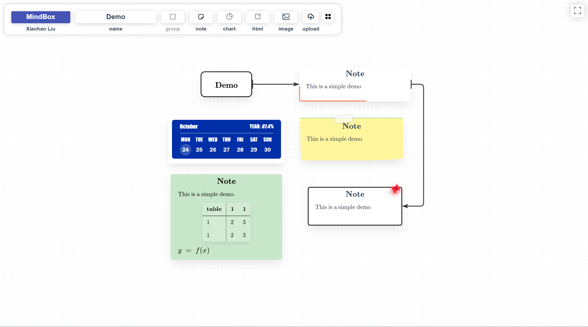

# mindbox


A MindMap application powered by **vue**, **antvis/X6** and **element**. This app is a pure web page without any backend for data interactions. Thus, it's **convenient** to build your own mindmap app.

Inspired by **XMind**, I designed the MindBox with many necessary and useful Features as follows:

- create child node
- create sibling node
- layout 
- note node
- upload to your gitee repo
- file manager (open an online file)
- ...

Enjoy it!

**Project setup**
```
npm install
```

**Compiles and hot-reloads for development**
```
npm run serve
```

**Compiles and minifies for production**
```
npm run build
```

**Lints and fixes files**
```
npm run lint
```

**Customize configuration**
See [Configuration Reference](https://cli.vuejs.org/config/).
