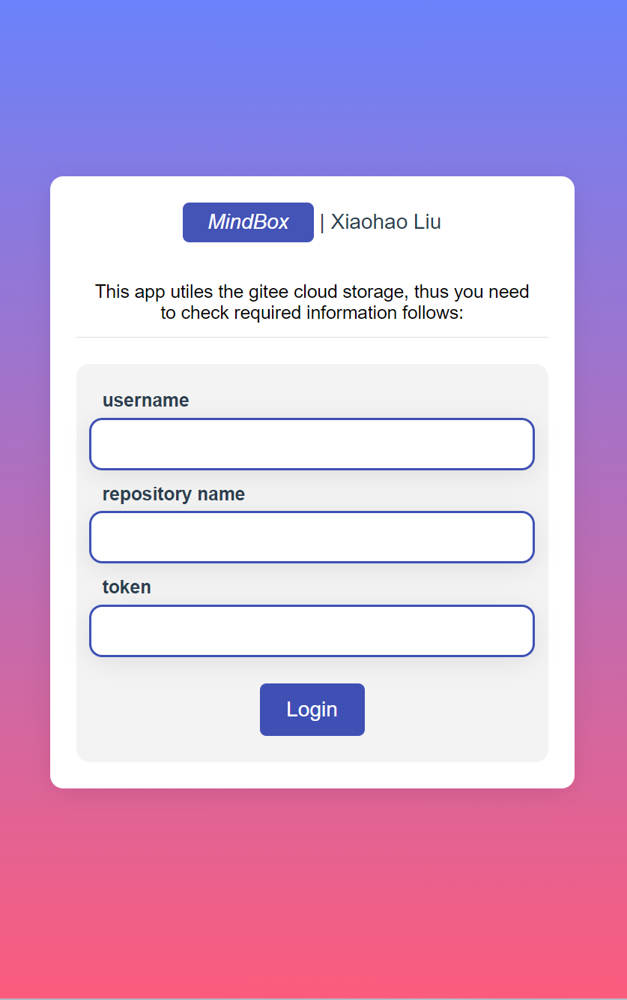

# mindbox 

A MindMap application powered by **vue**, **antvis/X6** and **element**. This app is a pure web page without any backend for data interactions. Thus, it's **convenient** to build your own mindmap app.

Inspired by **XMind**, I designed the MindBox with many necessary and useful Features as follows:

- create child node
- create sibling node
- layout 
- note node
- upload to your gitee repo
- file manager (open an online file)
- dark mode
- ...

Here is a [demo](http://wykxldz.gitee.io/mindbox/#/read?u=WYKXLDZ&r=MindBoxCollection&s=8f35c84f195d8dea7be1375e5453999c2553ebd4&n=Demo.mb&k=undefined) with gitee storage.

And you can use this app online by type your own gitee repository through [MindBox](http://wykxldz.gitee.io/mindbox).

Enjoy it!

